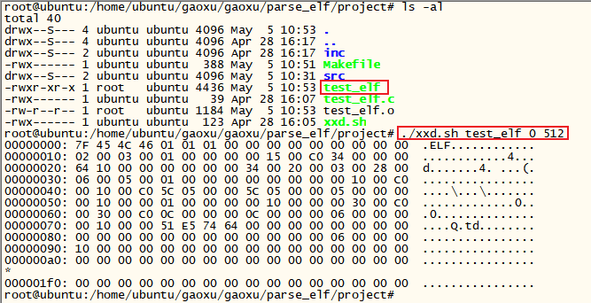

# 环境搭建
学习就从简单入手，我这边写了一个最简单的C程序，不依赖任何外部库，使用32位系统，i386机器进行编译链接。代码如下：

```c
void main(void)
{
    while (1);
}
```

其Makefile如下：

```makefile
CC		:= gcc
STRIP	:= strip
LD		:= ld
TEST_ELF := test_elf

PATHS := .
PATHS += ./src

FILES_ALL := $(foreach path, $(PATHS), $(wildcard $(path)/*.c))
FILE_ELF := $(filter %$(TEST_ELF).c, $(FILES_ALL))
FILES := $(filter-out %$(TEST_ELF).c, $(FILES_ALL))

OBJS_ALL := $(patsubst %.c, %.o, $(FILES_ALL))
OBJ_ELF := $(filter %$(TEST_ELF).o, $(OBJS_ALL))
OBJS := $(filter-out %$(TEST_ELF).o, $(OBJS_ALL))

INCS := ./inc
INC_PATH := $(foreach path, $(INCS), $(patsubst %, -I%, $(path)))

PHONY := all
PHONY += clean
PHONY += $(TEST_ELF)
.PHONY:$(PHONY)

all: $(TEST_ELF) main

$(TEST_ELF):$(OBJ_ELF)
	$(LD) $^ -Ttext 0xc0001500 -e main -m elf_i386 -o $@
	$(STRIP) $@

$(OBJ_ELF):$(FILE_ELF)
	$(CC) -c $^ -o $@ -m32

main:$(OBJS)
	$(CC) $^ -o $@ $(INC_PATH)

$(OBJS):$(FILES)
	$(CC) -c $^ -o $@ -Wall $(INC_PATH)

clean:
	$(RM) $(OBJS_ALL) main $(TEST_ELF)
```

链接时虚拟入口地址手动指定为 0xc0001500；程序的入口手动指定为 main；机器类型选择 elf_i386 进行链接；使用 -m32 指定进行32位系统编译。

工程中提供一个 xxd.sh 的脚本，用于查看二进制文件内容。使用方式如下：

```
$1: 查看的文件名
$2: 查看文件内的起始字节
$3: 连续查看的字节数
./xxd.sh $1 $2 $3
```

使用 make 后，会生成一个 test_elf 文件，使用如下命令即可查看文件文件内容：

```
./xxd.sh test_elf 0 512
```

上面命令意思为：查看test_elf文件的起始字节为0，连续查看512字节的内容。输出结果如下图：



后面的代码就先从这个最简单的 test_elf 文件入手进行 elf 格式的分析学习。

